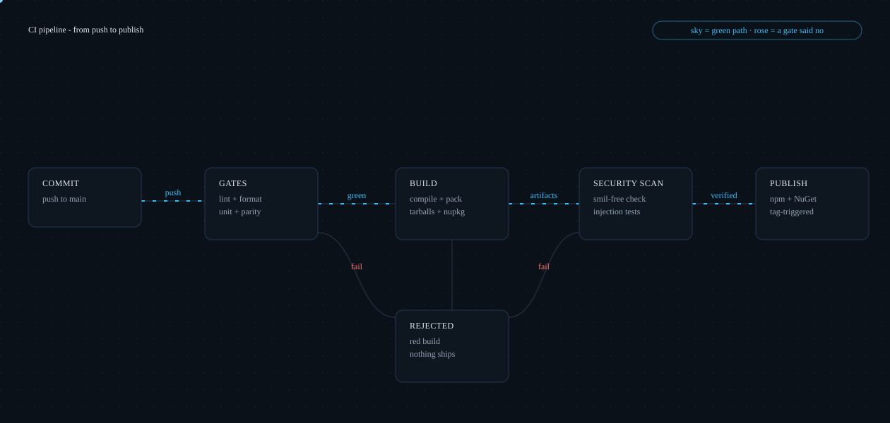
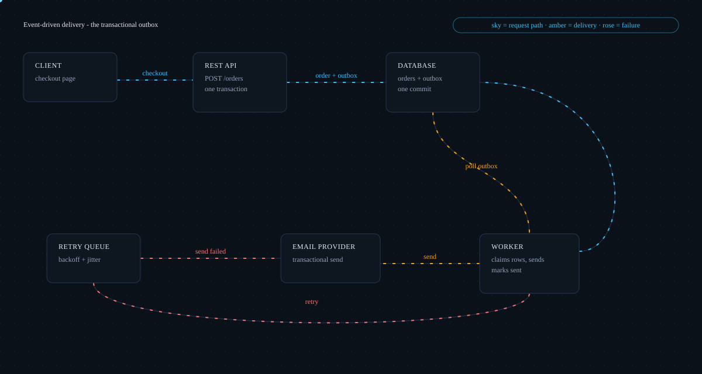
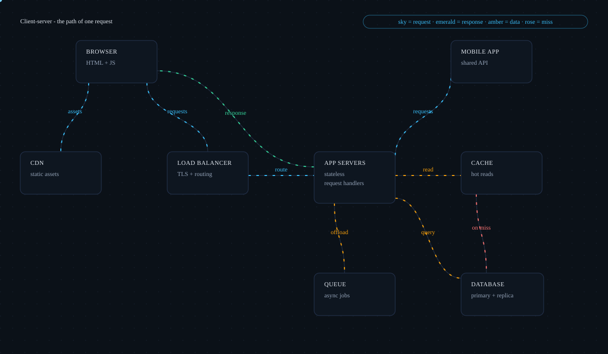

# FlowInk

**Animated architecture-flow diagrams as data: describe the boxes and the flows in a JSON
spec, get a self-contained SVG that animates anywhere a README renders.**

[](https://github.com/Alex5350/flowink/actions/workflows/ci.yml)

```bash
npx flowink render architecture.json     # -> architecture.svg, ready to commit
```

> **Two ways to read this page.** Not an engineer? Everything below the pictures stays in
> plain language, and jargon links to the [glossary](docs/GLOSSARY.md). Engineer? The deep
> dive lives in [TECHNICAL.md](TECHNICAL.md): architecture, the render path, and every
> major decision mapped back to the problem it solves.

## The problem

The architecture diagram in a README is often the only documentation people actually read,
and it is usually a hand-drawn picture: exported from a design tool, or hand-authored SVG.
That fails two ways. The picture goes stale, because it is a drawing of the system rather
than a description of it, so nothing notices when the two drift apart; keeping it current
means redrawing it by hand. And when maintainers animate those SVGs by hand, the animation
itself breaks exactly where it matters most.

The worst day in my portfolio was the day all four of my repos' README diagrams rendered as
**empty boxes on GitHub** while looking perfect in a direct browser tab. The cause, found by
stripping the files down piece by piece: the SVG animation elements I had used
([SMIL](docs/GLOSSARY.md)) cannot coexist with a stylesheet block in Chromium's SVG-as-image
path, which paints nothing instead. GitHub READMEs load images exactly that way. Four repos
shipped the defect before it was diagnosed.

What was needed is what FlowInk is: a diagram that is [data](docs/GLOSSARY.md) instead of a
drawing, and output that renders everywhere a README renders, animation included.

## The product in pictures

Every image below is one JSON spec rendered by FlowInk's CLI. Commit the spec and the SVG
together and the diagram stays regenerable: change the spec, re-render, and the diff is your
review. Full specs: [`docs/gallery/`](docs/gallery/).

| A CI pipeline, gate by gate | An event-driven backend, with retries |
|:---:|:---:|
|  |  |

The CI pipeline shows a push clearing lint and test gates, getting built, passing the
security scan, and only then publishing; a gate that fails routes the build to a rejected
path where nothing ships. The event-driven backend shows the API writing an order and its
outbox row in one database commit, a worker polling the outbox to send email, and a failed
send looping back through a retry queue with backoff.

| A client-server round trip | FlowInk rendering itself |
|:---:|:---:|
|  |  |

The round trip shows browser and mobile requests routed through a load balancer to stateless
app servers, reads checking the cache before the database, slow work offloaded to a queue,
and the response traveling back. The last picture is FlowInk's own pipeline, generated by
its own CLI from [`docs/diagrams/architecture.json`](docs/diagrams/architecture.json).

## What it delivers

- **One spec, four consumption environments.** The same JSON renders as a React/Next.js
  component, an Angular component, a Blazor component, or a CLI-rendered SVG for committing
  to READMEs.
- **README diagrams that actually animate on GitHub.** The output is
  [GitHub-safe](docs/GLOSSARY.md) by construction: CSS-only animation, no scripts, no
  external references, so it animates in the locked-down image context GitHub loads READMEs
  in instead of breaking the way hand-animated SVGs do.
- **Animation that respects the reader.** Readers who prefer reduced motion get a complete,
  still diagram: [prefers-reduced-motion](docs/GLOSSARY.md) freezes the motion, and meaning
  never rides on motion alone.
- **Diagrams that cannot drift between ecosystems.** The TypeScript and C# renderers are
  held to [byte-identical](docs/GLOSSARY.md) output on a committed fixture, so the same spec
  cannot silently produce a different diagram in the npm world than in the NuGet world.
- **Diagrams that stay reviewable.** A spec is [data](docs/GLOSSARY.md): it diffs line by
  line, regenerates deterministically, and can be generated or validated by anything that
  reads JSON.
- **Diagrams built from other people's specs cannot smuggle scripts.** Every piece of spec
  text is escaped and every number coerced at the point of use, so rendering an untrusted
  spec yields markup, never executable content.

## How the engineering solves it

Plain-terms bridge; the full story for each lives in
[TECHNICAL.md](TECHNICAL.md#how-the-tech-solves-the-business-problem).

- **Hand-animated SVGs break exactly where READMEs render them.** The renderer animates with
  CSS only and has no code path that could emit the SMIL elements that make GitHub's image
  pipeline paint nothing - so the diagram that animates in your editor is the same diagram
  that animates in the README.
- **Two ecosystems, one diagram, no drift.** A committed golden fixture is compared
  byte-for-byte against both renderers in CI, which means a diagram cannot quietly become
  different depending on whether an app installs from npm or NuGet.
- **Pictures go stale; data gets reviewed.** Specs are data with manual coordinates instead
  of hand-drawn files, so a diagram change is a reviewable JSON diff and regenerating the
  SVG is a one-command check that the picture still matches the description.
- **"Diagrams from users" must not mean "scripts from users".** Every framework wrapper
  injects the rendered SVG as raw markup, so the renderer treats all spec content as
  untrusted input: escaped, coerced, and tested against a malicious-spec battery.

<details>
<summary><b>For developers: quickstart</b></summary>

Condensed reference; the step-by-step runbooks for every consumer live in
[docs/quickstarts.md](docs/quickstarts.md), and the full spec reference in
[TECHNICAL.md](TECHNICAL.md#the-spec-in-full). Packages are not yet on registries, so
consumption starts from a clone:

```bash
git clone https://github.com/Alex5350/flowink.git
cd flowink
npm install
npm run build          # @flowink/core, @flowink/react, @flowink/angular, flowink CLI
npm test               # TypeScript tests (core + react)
dotnet build dotnet/FlowInk.slnx && dotnet run --project dotnet/tests/FlowInk.Tests   # parity suite
```

**CLI - the README workflow:**

```bash
node packages/cli/dist/cli.js render spec.json -o docs/diagrams/architecture.svg
```

Commit both the spec and the SVG: the spec is the source, the SVG is the build artifact,
and diffing the regenerated SVG is your review.

**From packed tarballs** (how the library was validated against real consumers, until
publication; see [docs/quickstarts.md](docs/quickstarts.md)):

```bash
npm pack -w @flowink/core -w @flowink/react -w @flowink/angular -w flowink-cli --pack-destination /tmp/packs
# in the consuming app (install together while unpublished - core is a peer dep):
npm install /tmp/packs/flowink-core-0.1.2.tgz /tmp/packs/flowink-react-0.1.2.tgz
npm install -g /tmp/packs/flowink-cli-0.1.2.tgz   # CLI bundles core; zero other dependencies
```

**Per framework** (one-liners; full recipes in [docs/quickstarts.md](docs/quickstarts.md)):

```tsx
import { FlowDiagram } from '@flowink/react';   // <FlowDiagram spec={spec} /> - RSC/SSR safe
```

```ts
import { FlowDiagramComponent } from '@flowink/angular';   // <flowink-diagram [spec]="spec" />
```

```xml
<FlowDiagram Spec="spec" />   <!-- Blazor static SSR; Pulse = true reads naturally in C# -->
```

Repository layout: `packages/` (core, react, angular, cli), `apps/demo-angular/` (compiling,
runnable consumer proof), `dotnet/` (FlowInk.Core renderer, FlowInk.Blazor, parity tests).

</details>

## Packages

All packages live in this repository (not yet published to registries).

| Package | Ecosystem | What you get |
|---|---|---|
| [`@flowink/core`](packages/core) | TypeScript | `renderFlow(spec)` - the renderer + types, zero dependencies |
| [`@flowink/react`](packages/react) | React / Next.js | `<FlowDiagram spec={...} />` - pure function of props, RSC/SSR-safe |
| [`@flowink/angular`](packages/angular) | Angular | `<flowink-diagram [spec]="spec" />` - ng-packagr compiled, standalone, OnPush |
| [`FlowInk.Core`](dotnet/src/FlowInk.Core) | .NET | C# renderer with JSON spec parsing, parity-tested |
| [`FlowInk.Blazor`](dotnet/src/FlowInk.Blazor) | Blazor | `<FlowDiagram Spec="..." />` - static SSR, no JS interop |
| [`flowink`](packages/cli) | CLI | `flowink render spec.json -o diagram.svg` - the README workflow |

Demo: [`apps/demo-angular`](apps/demo-angular) compiles the Angular component via path
mappings and renders a live diagram (verified build + runtime).

## Documentation

| Document | What it covers | Audience |
|---|---|---|
| [TECHNICAL.md](TECHNICAL.md) | Architecture, the render path, decisions mapped to problems, spec reference, testing | Engineers |
| [docs/GLOSSARY.md](docs/GLOSSARY.md) | Every term this repo uses, in plain English and precisely | Everyone |
| [docs/tutorial.md](docs/tutorial.md) | The from-scratch walkthrough: every rule taught alongside the mistake that taught it | Engineers |
| [docs/quickstarts.md](docs/quickstarts.md) | Step-by-step runbooks for Next.js, Angular, CLI, and Blazor consumers | Engineers |
| [docs/adr/](docs/adr/) | Four architecture decision records | Engineers |
| [docs/findings-first-consumer-validation.md](docs/findings-first-consumer-validation.md) | What broke when real sample apps consumed the packed artifacts, and the fixes | Engineers |
| [docs/limitations.md](docs/limitations.md) | What FlowInk deliberately does not do, and known quirks | Everyone |
| [docs/publishing.md](docs/publishing.md) | The npm + NuGet release runbook | Maintainers |
| [docs/contributing.md](docs/contributing.md) | Environment traps hit while building, with detection and fixes | Contributors |

## License

[MIT](LICENSE)
