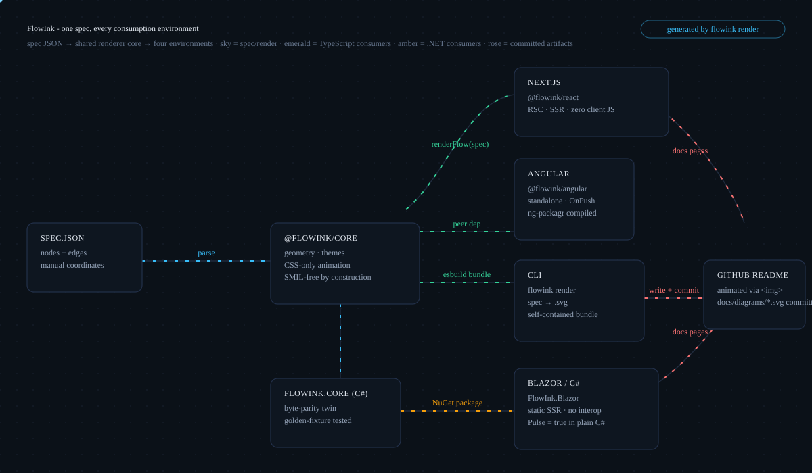

# FlowInk

**Animated architecture-flow diagrams as data.** Describe nodes and edges in JSON;
get a self-contained SVG with flowing dashes, breathing nodes, and a riding packet -
rendered by a CLI for committing to READMEs, or by components for React, Angular, and
Blazor.

```bash
npx flowink render architecture.json     # -> architecture.svg, ready to commit
```



*(That diagram is FlowInk rendering its own pipeline, generated by its own CLI from
[`docs/diagrams/architecture.json`](docs/diagrams/architecture.json).)*

## Why

The animated diagrams across my portfolio READMEs were hand-authored SVGs, and every
rule in them was learned by shipping the failure first - the worst being the day all
four repos' diagrams rendered as **empty boxes on GitHub**: SMIL animation elements
combined with a CSS block make Chromium's SVG-as-image path paint nothing, and GitHub
READMEs are exactly that context.

FlowInk encodes those lessons as structure:

- **CSS-only animation - SMIL is structurally impossible.** The renderer has no code
  path that emits `<animate>`; tests assert its absence on both stacks. Dash-flow
  math is seam-safe (dashoffset targets equal the dash period), pulses and
  `offset-path` packets included.
- **One JSON spec, two byte-parity renderers.** `@flowink/core` (TypeScript) and
  `FlowInk.Core` (C#) produce identical output on a committed golden fixture - parity
  enforced by tests, not intent. The JS-vs-C# rounding traps that had to be solved are
  recorded in [ADR 0002](docs/adr/0002-spec-parity.md).
- **``-context safe by construction.** No scripts, no external references
  (system font stacks), everything escaped, `prefers-reduced-motion` honored.
- **Manual placement, on purpose.** At architecture-diagram scale, judgment beats
  auto-layout; the renderer sizes boxes from content and derives edge geometry, with
  per-edge path overrides when you want the fancy curves.

## Packages

All packages live in this repository (not yet published to registries - see
[Setup and usage](#setup-and-usage) for consumption wiring).

| Package | Ecosystem | What you get |
|---|---|---|
| [`@flowink/core`](packages/core) | TypeScript | `renderFlow(spec)` - the renderer + types, zero dependencies |
| [`@flowink/react`](packages/react) | React / Next.js | `<FlowDiagram spec={...} />` - pure function of props, RSC/SSR-safe |
| [`@flowink/angular`](packages/angular) | Angular | `<flowink-diagram [spec]="spec" />` - ng-packagr compiled (FESM + types), standalone, OnPush |
| [`FlowInk.Core`](dotnet/src/FlowInk.Core) | .NET | C# renderer with JSON spec parsing, parity-tested |
| [`FlowInk.Blazor`](dotnet/src/FlowInk.Blazor) | Blazor | `<FlowDiagram Spec="..." />` - static SSR, no JS interop |
| [`flowink`](packages/cli) | CLI | `flowink render spec.json -o diagram.svg` - the README workflow |

Demo: [`apps/demo-angular`](apps/demo-angular) compiles the Angular component via
path mappings and renders a live diagram (verified build + runtime).

## The spec

A diagram is a JSON document. This is the complete schema - every field, its default,
and what it does:

**Top level**

| Field | Type | Default | Meaning |
|---|---|---|---|
| `title` | string | *required* | Diagram title; also the SVG `<title>` for accessibility |
| `subtitle` | string | - | Muted line under the title; use it for the color legend |
| `chip` | string | - | Right-aligned pill with a one-line guarantee |
| `theme` | `"dark" \| "light"` | `"dark"` | Showcase dark, or a paper light palette |
| `width` / `height` | number | 1200 / 640 | Canvas pixels |
| `nodes` | FlowNode[] | *required* | The boxes |
| `edges` | FlowEdge[] | *required* | The flows |

**FlowNode**

| Field | Type | Default | Meaning |
|---|---|---|---|
| `id` | string | *required* | Edge reference target |
| `label` | string | *required* | Bold first line |
| `lines` | string[] | `[]` | Detail lines (smaller, muted) |
| `x`, `y` | number | *required* | Top-left corner, canvas pixels - manual placement is deliberate ([ADR 0003](docs/adr/0003-manual-layout.md)) |
| `width`, `height` | number | content-derived | Box size; the renderer wraps your longest line |
| `pulse` | boolean \| number | - | Border "breathing" (`true` = 3s cycle; a number sets milliseconds) |

**FlowEdge**

| Field | Type | Default | Meaning |
|---|---|---|---|
| `from`, `to` | string | *required* | Node ids |
| `color` | `"sky" \| "emerald" \| "amber" \| "rose"` | `"sky"` | Sky = primary path, emerald = auth, amber = integrations, rose = fallback |
| `label` | string | - | Small colored label at the path midpoint |
| `direction` | `"forward" \| "backward" \| "none"` | `"forward"` | Dash march direction; `none` = static |
| `packet` | boolean | - | A dot rides the path (CSS Motion Path) |
| `path` | string | auto | Manual SVG path data from `from` to `to`, overriding the auto geometry |

Edge geometry is derived from how boxes face each other (straight when aligned, one
gentle curve when not); provide `path` when you want a deliberate custom route.
Working example: [`docs/diagrams/architecture.json`](docs/diagrams/architecture.json).

## Setup and usage

### From the repository (packages are not on npm yet)

```bash
git clone https://github.com/Alex5350/flowink.git
cd flowink
npm install
npm run build          # @flowink/core, @flowink/react, flowink CLI
npm test               # TypeScript tests (core + react)
```

Until the packages are published, consume them one of two proven ways:

**In-app (workspace wiring)** - npm workspaces + tsconfig path mappings, the way the
demo app does (see [`apps/demo-angular`](apps/demo-angular/tsconfig.json)):

```jsonc
// your app's tsconfig.json
{
  "compilerOptions": {
    "paths": {
      "@flowink/core": ["../flowink/packages/core/src/index.ts"],
      "@flowink/react": ["../flowink/packages/react/src/index.ts"]
    }
  }
}
```

**From packed tarballs** - the closest thing to `npm install` before publishing, and
how the library was validated against real consumers
([findings](docs/findings-first-consumer-validation.md)):

```bash
cd packages/core && npm pack --pack-destination /tmp/packs
cd ../react && npm pack --pack-destination /tmp/packs
cd ../angular && npm run build && npm pack --pack-destination /tmp/packs   # ng-packagr first
cd ../cli && npm run build && npm pack --pack-destination /tmp/packs       # self-contained bundle

# in the consuming app (install together while unpublished - core is a peer dep):
npm install /tmp/packs/flowink-core-0.1.0.tgz /tmp/packs/flowink-react-0.1.0.tgz
npm install -g /tmp/packs/flowink-cli-0.1.0.tgz   # CLI needs nothing else
```

### CLI - the README workflow

```bash
node packages/cli/dist/cli.js render spec.json          # -> spec.svg
node packages/cli/dist/cli.js render spec.json -o docs/diagrams/architecture.svg
```

Commit both the spec and the SVG: the spec is the source, the SVG is the build
artifact, and diffing the regenerated SVG is your review.

### React / Next.js

```tsx
import { FlowDiagram } from '@flowink/react';   // wire per the path-mapping note above

export function Page() {
  return <FlowDiagram spec={spec} />;           // pure function of props: RSC/SSR safe
}
```

For static output (build-time, no React needed): `renderFlowToString(spec)`.

### Angular

```ts
import { FlowDiagramComponent } from '@flowink/angular';

@Component({
  standalone: true,
  imports: [FlowDiagramComponent],
  template: `<flowink-diagram [spec]="spec" />`,
})
export class Shell { spec = mySpec; }
```

The component is standalone + OnPush and injects only the core renderer. The demo app
in [`apps/demo-angular`](apps/demo-angular/src/main.ts) compiles and renders it end to
end - copy its tsconfig paths and package wiring.

### Blazor / .NET

```xml
<FlowDiagram Spec="spec" />
@code {
    FlowSpec spec = FlowRenderer.ParseSpecJson(await File.ReadAllTextAsync("diagram.json"));
}
```

`FlowInk.Core` is renderer-only (usable from any .NET code); `FlowInk.Blazor` adds the
component. Static SSR renders identically to interactive - no JS interop anywhere.

```bash
dotnet build dotnet/FlowInk.slnx
dotnet run --project dotnet/tests/FlowInk.Tests   # parity + guarantees suite
```

### Repository layout

```text
packages/core/     TypeScript renderer (zero dependencies)
packages/react/    React component (SSR-safe)
packages/angular/  Angular standalone component
packages/cli/      flowink render - the README workflow
apps/demo-angular/ compiling, runnable consumer proof
dotnet/src/        FlowInk.Core (C# renderer) + FlowInk.Blazor
dotnet/tests/      parity suite with the committed golden fixture
docs/              tutorial, ADRs, diagrams (spec + generated svg)
```

### Troubleshooting

- **Diagram renders in a browser tab but blank inside an ``/GitHub README** -
  that is the SMIL trap (see the tutorial, Part 6); FlowInk output cannot trigger it,
  so if you see it, the file was not FlowInk-rendered. Verify with the tutorial's
  img-context test page.
- **A label collides with a line** - nudge node coordinates or supply a manual edge
  `path`; manual placement means manual collision duty ([ADR 0003](docs/adr/0003-manual-layout.md)).
- **`npm install` picks up an Angular cache** - `.angular/` is gitignored; if you
  copied the demo, keep that ignore line.

## The tutorial

**[docs/limitations.md](docs/limitations.md)** catalogs what FlowInk deliberately
does not do and the behaviors most likely to surprise (label collision duty, manual
path caveats, embedding rules). **[docs/contributing.md](docs/contributing.md)**
records the environment traps hit while building it - a global-gitignore exclusion
of `packages/`, workspace-name collisions, npm 10/11 lockfile splits - with
detection and fixes.

**[docs/tutorial.md](docs/tutorial.md)** is the granular, from-scratch walkthrough:
canvas anatomy, the dot pattern, content-sized nodes, the dash-math that makes flows
seamless, bidirectional flow, pulses, CSS Motion Path packets, the accessibility
close-out, the SMIL trap (with its detection protocol), and the boring delivery
failures - cache keys, references that silently failed to insert. Every rule is
taught alongside the mistake that taught it.

## Decisions

- [ADR 0001](docs/adr/0001-css-only-animation.md) - CSS-only animation; SMIL structurally banned
- [ADR 0002](docs/adr/0002-spec-parity.md) - one JSON spec, two renderers, enforced parity
- [ADR 0003](docs/adr/0003-manual-layout.md) - manual node placement; no auto-layout in v1
- [ADR 0004](docs/adr/0004-injection-trust-boundary.md) - the injection trust boundary

**Validated, not just built**: three fresh sample apps (Next.js RSC, Angular, Blazor
static SSR) and a global CLI install consumed the packed artifacts; every failure they
found and the fix that followed is recorded in
[docs/findings-first-consumer-validation.md](docs/findings-first-consumer-validation.md).

## License

[MIT](LICENSE)
